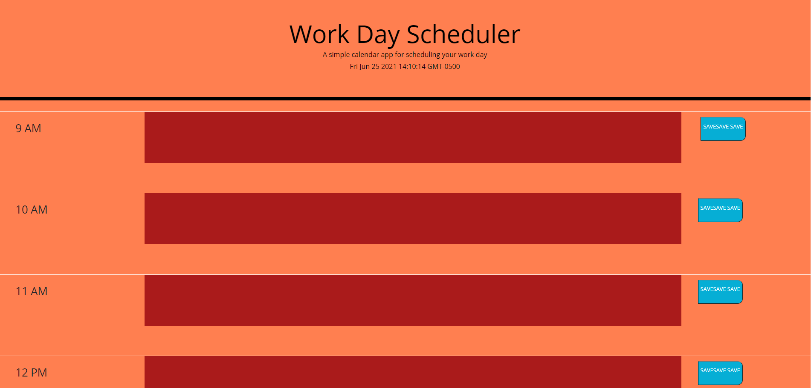

# CodingCalendar

This is my code calendar project. The colors change based on the time of day, if they are before the current hour (as in the time has passed) they are red. If the bar represents the current hour of the day it is salmon. If the bar is after the current hour (as in the hour is coming up) then the bar is green. Users are also able to save they're calendar notes to each hour column, and the program will save the notes to local storage to access later.

[Link to deployed app](https://maxdamoe.github.io/CodingCalendar/)
